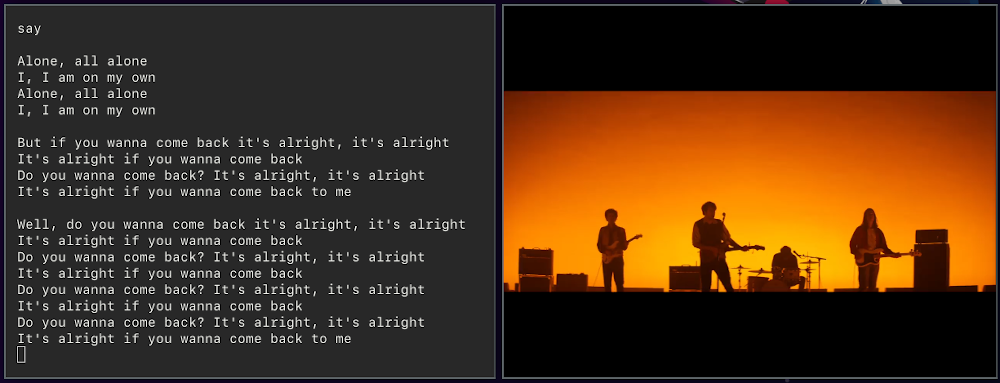

# Spotify Music videos

A simple tool to show Youtube **music videos** and **lyrics** for the currently playing Spotify songs with VLC. This version has been rewritten in C++ for learning purposes and to hopefully have less lag.



## Dependencies

You'll need the following libraries installed:

* GLib

* DBus

* GObject

## How to install

You can use `cmake` and `make` to build it manually for now (inside the main folder):

`cmake . && make`

`./spotify-videos`

## How to use

You can use these flags to modify the behavior of the program:

```
usage: spotify-videos [-h] [-v] [--debug] [-n] [-f] [-a VLC_ARGS]
                          [--width MAX_WIDTH] [--height MAX_HEIGHT] [-w]
                          [--username USERNAME] [--client-id CLIENT_ID]
                          [--client-secret CLIENT_SECRET]
                          [--redirect-uri REDIRECT_URI]

Windows and Mac users must pass --username, --client-id and --client-secret to
use the web API. Read more about how to obtain them in the README
(https://github.com/marioortizmanero/spotify-music-videos).

optional arguments:
  -h, --help            show this help message and exit
  -v, --version         show program's version number and exit.
  --debug               display debug messages
  -n, --no-lyrics       do not print lyrics
  -f, --fullscreen      play videos in fullscreen mode
  -a VLC_ARGS, --args VLC_ARGS
                        other arguments used when opening VLC. Note that some
                        like args='--fullscreen' won't work in here
  --width MAX_WIDTH     set the maximum width for the played videos
  --height MAX_HEIGHT   set the maximum height for the played videos
  -w, --use-web-api     forcefully use Spotify's web API
  --username USERNAME   your Spotify username. Mandatory if the web API is
                        being used. Example: --username='yourname'
  --client-id CLIENT_ID
                        your client ID. Mandatory if the web API is being
                        used. Check the README to see how to obtain yours.
                        Example: --client-
                        id='5fe01282e44241328a84e7c5cc169165'
  --client-secret CLIENT_SECRET
                        your client secret ID. Mandatory if the web API is
                        being used. Check the README to see how to obtain
                        yours. Example: --client-
                        secret='2665f6d143be47c1bc9ff284e9dfb350'
  --redirect-uri REDIRECT_URI
                        the redirect URI for the web API. Not necessary as it
                        defaults to 'http://localhost:8888/callback/'
```

---

## Current limitations:
* Spotify doesn't currently (15/07/19) support the MPRIS property `Position` so the starting offset is calculated manually and may be a bit rough.
* To configure the maximum size of VLC's window a GUI would need to be implemented, like tkinter. The project would be much less minimal that way, but more features could be implemented, like lyrics inside the GUI.
* Spotify's Web API doesn't allow function calls on updates like Dbus, meaning that the metadata has to be manually updated every second and checked in case of changes.

## Differences with the python implementation

Benchmark:

```c++
// Rough benchmark. Add this to main and modify play_videos_dbus to return the offset time before wait()
// Disable the spotify part, only do it for a single song
void benchmark(int reps, DbusPlayer spotify) {
    int total = 0;
    int time = 0;
    for (int i=0; i<reps; i++) {
        time = play_videos_dbus(spotify.player, spotify);
        total += time;
    }
    std::cout << "TOTAL TIME: " << total << "\n";
    double average = total/reps;
    std::cout << "AVERAGE: " << average << std::endl;
}
```

```python
# Rough benchmark. Add this to main and modify play_videos_dbus to return the offset time before wait()
# Disable the spotify part, only do it for a single song
def benchmark(int reps, DbusPlayer spotify):
    total = 0
    time = 0

    for i in range(reps):
        time = play_videos_dbus(spotify.player, spotify)
        total += time

    print("TOTAL TIME: {}".fomat(total))
    average = total/reps
    print("AVERAGE: {}".format(average))
```

02/07/2019 results with reps=100, lyrics disabled, name = "Arctic Monkeys", only dbus
```
C++:
    TOTAL TIME: 243471
    AVERAGE: 2434
PYTHON:
    TOTAL TIME: 175593
    AVERAGE: 1755
```


## Documentation

Helpful documentation links for contributing:
* [DBus](https://dbus.freedesktop.org/doc/dbus-specification.html)
* [MPRIS](https://specifications.freedesktop.org/mpris-spec/latest/Player_Interface.html#Property:Position)
* [VLC](https://wiki.videolan.org/LibVLC/), [LibVLC](https://www.videolan.org/developers/vlc/doc/doxygen/html/group__libvlc.html)

